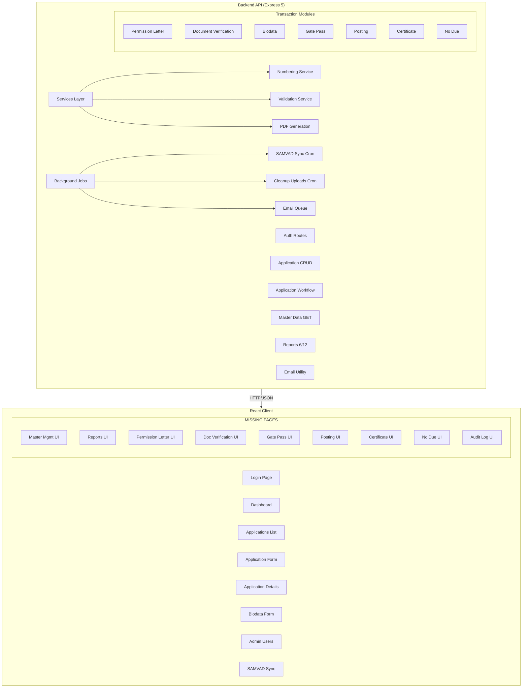

# VTMS Implementation Status & Plan

## Overview

Full-stack Vocational Training Management System for GNFC Ltd.  
**Backend**: Express 5 + TypeScript + Prisma/PostgreSQL  
**Frontend**: React 19 + TypeScript + Vite + MUI  
**Status**: Core infrastructure ~80% complete, Transaction flows ~50% complete, Reports ~30% complete, Client pages ~30% complete

---

## ✅ IMPLEMENTED

### Backend — Complete

| Module                    | Status | Details                                                                                               |
| ------------------------- | ------ | ----------------------------------------------------------------------------------------------------- |
| Auth (login/logout/me)    | ✅     | JWT-based, cookie auth                                                                                |
| Application CRUD          | ✅     | Full create/read/update/delete with status machine (20 states), search, filters, stats                |
| Application Workflow      | ✅     | status, scrutinize, permission-letter, join patches                                                   |
| Master Data (GET)         | ✅     | Categories, Branches, Colleges, States, Districts, Talukas, Cities, Departments                       |
| SAMVAD Sync               | ✅     | HTML scraping + cron job                                                                              |
| File Upload               | ✅     | Single + multiple via multer                                                                          |
| User Management           | ✅     | List all users                                                                                        |
| Permission Letter         | ✅     | PDF generation + ref update + email enqueue                                                           |
| Document Verification     | ✅     | Create, list by app, verify inline                                                                    |
| Biodata                   | ✅     | Get, upsert, generate PDF                                                                             |
| Gate Pass                 | ✅     | Generate PDF (front + back)                                                                           |
| Posting                   | ✅     | List, create (with students), get by ID                                                               |
| Certificate               | ✅     | List, create, approve duplicate, generate PDF                                                         |
| No Due                    | ✅     | List, get/create by app, clear line, finalize                                                         |
| Reports (6 of 12)         | ⚠️     | application-register, approved, permissions, branch-wise, college-wise, training-completed            |
| PDF Generation (5)        | ✅     | Permission letter, biodata, gate pass, certificate, posting letter                                    |
| Numbering Service         | ⚠️     | Basic FY-aware, needs branch encoding                                                                 |
| Validation Service        | ⚠️     | Basic required fields, needs full eligibility rules                                                   |
| Email Utility             | ✅     | nodemailer transporter + approval links                                                               |
| Audit Log Middleware      | ✅     | Passive recording                                                                                     |
| Background Jobs           | ✅     | samvadSync cron, cleanupUploads cron, queue starter                                                   |
| Error Handler             | ✅     | Express error middleware                                                                              |
| Prisma Schema (24 models) | ✅     | All entities defined with relations                                                                   |
| Seeds                     | ✅     | Users, employees, F.Y., categories, branches, colleges, states, districts, talukas, cities (from CSV) |
| Queue                     | ✅     | bee-queue starter                                                                                     |

### Frontend — Complete

| Page                | Status | Details                                                                                             |
| ------------------- | ------ | --------------------------------------------------------------------------------------------------- |
| Login               | ✅     | Auth form with role-based redirect                                                                  |
| Dashboard           | ✅     | Stats cards (total apps, pending, approved, rejected)                                               |
| Applications List   | ✅     | Searchable, filterable table with status badges                                                     |
| Application Form    | ✅     | New/edit with master data dropdowns, file upload                                                    |
| Application Details | ✅     | Status mgmt, scrutiny, permission letter, doc verification display, joining details                 |
| Biodata Form        | ✅     | Basic form with photo upload                                                                        |
| Admin Users         | ✅     | User list table                                                                                     |
| Samvad Sync         | ✅     | Sync trigger button with results display                                                            |
| Layout/Sidebar      | ⚠️     | Has nav items: Dashboard, Applications, Users, SAMVAD Sync — missing Masters, Reports, Transactions |
| Auth Context        | ✅     | Login state management                                                                              |
| API Client          | ✅     | Axios with credentials                                                                              |

---

## ❌ NOT IMPLEMENTED / PENDING

### Phase 1: Backend Transaction Flow Completion

| #   | Item                                 | Details                                                                                                                                                                                                                   | Backend                                                                 | Frontend                         |
| --- | ------------------------------------ | ------------------------------------------------------------------------------------------------------------------------------------------------------------------------------------------------------------------------- | ----------------------------------------------------------------------- | -------------------------------- |
| 1   | **Scrutiny Controller**              | [`api/src/routes/scrutiny.routes.ts`](api/src/routes/scrutiny.routes.ts) — empty shell, returns `[]`                                                                                                                      | ❌ Needs full controller with GET/POST/PATCH for scrutiny records       | ❌ No scrutiny management UI     |
| 2   | **Employee Controller**              | [`api/src/routes/employee.routes.ts`](api/src/routes/employee.routes.ts) — empty shell                                                                                                                                    | ❌ Needs list/search/filter for SAMVAD-synced employees                 | ❌ No employee search/display UI |
| 3   | **Master Data CRUD**                 | [`api/src/routes/master.routes.ts`](api/src/routes/master.routes.ts) — READ only                                                                                                                                          | ❌ Needs POST/PUT/DELETE for all 8 master entities                      | ❌ No master management pages    |
| 4   | **Posting Letter PDF via Route**     | Generator exists in [`api/src/services/pdf.service.ts`](api/src/services/pdf.service.ts:159) but route [`api/src/routes/posting.routes.ts`](api/src/routes/posting.routes.ts:18) creates posting with manual inline logic | ⚠️ Needs `/postings/:id/generate` endpoint that uses pdfService         | ❌ No posting planner/print UI   |
| 5   | **No Due PDF Generation**            | [`api/src/services/pdf.service.ts`](api/src/services/pdf.service.ts) — no noDue PDF generator                                                                                                                             | ❌ Needs PDF generator for clearance certificate                        | ❌ No no-due print UI            |
| 6   | **Permission Letter Email Workflow** | [`api/src/utils/email.ts`](api/src/utils/email.ts) — has email utility but no rich HTML templates                                                                                                                         | ❌ Needs Handlebars email templates for permission letter notifications | ❌ No email preview/log UI       |

### Phase 2: Frontend Transaction Pages

| #   | Item                                    | Details                                                                       | Priority |
| --- | --------------------------------------- | ----------------------------------------------------------------------------- | -------- |
| 7   | **Permission Letter Management UI**     | Composer/preview page with PDF download + email send trigger                  | High     |
| 8   | **Document Verification Management UI** | Dedicated page or section with checklist, upload, verify workflow             | High     |
| 9   | **Gate Pass Print/Management UI**       | Print view with front/back page rendering + issuance tracking                 | High     |
| 10  | **Posting Planner UI**                  | Group trainees by plant/department, assign colleges, generate posting letters | High     |
| 11  | **Certificate Composer UI**             | Select template, approve duplicates, generate PDF                             | High     |
| 12  | **No Due Clearance UI**                 | Line-by-line clearance, finalize, print certificate                           | High     |

### Phase 3: Reports Completion

| #   | Item                    | Details                                                                                                                                                                       | Backend                                                                                              | Frontend                                                  |
| --- | ----------------------- | ----------------------------------------------------------------------------------------------------------------------------------------------------------------------------- | ---------------------------------------------------------------------------------------------------- | --------------------------------------------------------- |
| 13  | **Missing 6 Reports**   | Per VTMS.md: in-charge wise, college wise applications, plant/department wise posting, recommended by employee, other references, employee's son/daughter, training during FY | ❌ 6 report endpoints needed in [`api/src/routes/report.routes.ts`](api/src/routes/report.routes.ts) | ❌ Reports page with date filters, charts, CSV/PDF export |
| 14  | **Report Enhancements** | Existing 6 reports need date range filters, CSV/PDF export                                                                                                                    | ⚠️ Basic aggregation only                                                                            | ❌ No report viewing page                                 |

### Phase 4: Business Rules & Cross-Cutting

| #   | Item                            | Details                                                                                                                                                                                                                                                          | Backend                                                                                                   | Frontend                                   |
| --- | ------------------------------- | ---------------------------------------------------------------------------------------------------------------------------------------------------------------------------------------------------------------------------------------------------------------- | --------------------------------------------------------------------------------------------------------- | ------------------------------------------ |
| 15  | **Full Eligibility Validation** | VTMS.md specifies: employee_ward → years 1-4, other_reference → years 2-4; category must be Master/Bachelor/Diploma; presently_pursuing + training_compulsory + part_of_curriculum + full_time_course must all be true; course + branch must be from master list | ❌ [`api/src/services/validation.service.ts`](api/src/services/validation.service.ts) — basic only        | ❌ Client-side validation not mirrored     |
| 16  | **Numbering Enhancement**       | VTMS.md: application_no = `FY{A_B}-{BRANCH_CODE}-{SERIAL}`; permission letter, certificate, no-due refs need proper branch-encoded serial per FY                                                                                                                 | ⚠️ [`api/src/services/numbering.service.ts`](api/src/services/numbering.service.ts) — basic counting only | ❌ No numbering preview                    |
| 17  | **Audit Log Viewer**            | Middleware records logs; no retrieval endpoint                                                                                                                                                                                                                   | ❌ Needs GET /api/audit-logs with filters                                                                 | ❌ No audit log viewer page                |
| 18  | **Navigation Update**           | [`client/src/components/Layout.tsx`](client/src/components/Layout.tsx) — sidebar missing: Masters, Reports, Permission Letters, Gate Pass, Posting, Certificates, No Dues                                                                                        | N/A                                                                                                       | ❌ Needs role-based nav items + routes     |
| 19  | **New Frontend Routes**         | [`client/src/App.tsx`](client/src/App.tsx) — missing routes for all transaction pages                                                                                                                                                                            | N/A                                                                                                       | ❌ Add Router Routes for all missing pages |

### Phase 5: Polish & Infrastructure

| #   | Item                         | Details                                                                                                                   |
| --- | ---------------------------- | ------------------------------------------------------------------------------------------------------------------------- |
| 20  | **`.env.example` Review**    | [`api/.env.example`](api/.env.example) exists, verify it covers all vars (SMTP, SAMVAD, JWT, DB, CLIENT_URL)              |
| 21  | **Email Templates**          | Convert raw HTML strings to Handlebars templates with proper GNFC branding                                                |
| 22  | **Testing**                  | Only [`api/test/uploads.test.ts`](api/test/uploads.test.ts) exists. Add unit tests for numbering, validation, PDF service |
| 23  | **Scheduled Job Monitoring** | Add logging/alerting for samvadSync, cleanupUploads, queue failures                                                       |

---

## Architecture Diagram — Module Dependency

---

## Application State Machine

```mermaid
flowchart LR
    DRAFT --> PENDING_SCRUTINY
    PENDING_SCRUTINY --> SCRUTINY_FAILED
    SCRUTINY_FAILED --> DRAFT
    PENDING_SCRUTINY --> SCRUTINY_PASSED
    SCRUTINY_PASSED --> PENDING_PERMISSION_LETTER
    PENDING_PERMISSION_LETTER --> PERMISSION_LETTER_GENERATED
    PERMISSION_LETTER_GENERATED --> PERMISSION_LETTER_SENT
    PERMISSION_LETTER_SENT --> PENDING_DOCUMENT_VERIFICATION
    PENDING_DOCUMENT_VERIFICATION --> DOCUMENT_VERIFICATION_PASSED
    DOCUMENT_VERIFICATION_PASSED --> PENDING_JOINING
    PENDING_JOINING --> JOINING_DONE
    JOINING_DONE --> PENDING_BIODATA
    PENDING_BIODATA --> BIODATA_COMPLETED
    BIODATA_COMPLETED --> PENDING_GATE_PASS
    PENDING_GATE_PASS --> GATE_PASS_ISSUED
    GATE_PASS_ISSUED --> PENDING_POSTING
    PENDING_POSTING --> POSTING_DONE
    POSTING_DONE --> PENDING_COURSE_COMPLETION
    PENDING_COURSE_COMPLETION --> COURSE_COMPLETED
    COURSE_COMPLETED --> PENDING_CERTIFICATE
    PENDING_CERTIFICATE --> CERTIFICATE_ISSUED
    CERTIFICATE_ISSUED --> PENDING_NO_DUE
    PENDING_NO_DUE --> NO_DUE_CLEARED
    NO_DUE_CLEARED --> CLOSED
```

---

## Pending Todo List (Actionable)

See `todo.md` for the flattened, numbered checklist ordered by execution priority.
