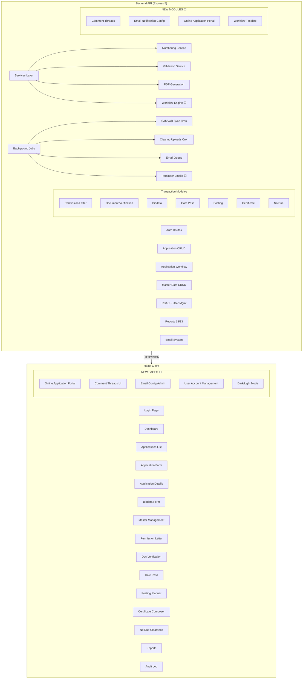

# VTMS — Updated Implementation Status & Plan

## Current Status: ~80% Complete

Full-stack Vocational Training Management System for GNFC Ltd.  
**Backend**: Express 5 + TypeScript + Prisma/PostgreSQL  
**Frontend**: React 19 + TypeScript + Vite + MUI

---

## ✅ COMPLETED — Backend (27/32 modules)

| Module                     | Status | Details                                                            |
| -------------------------- | ------ | ------------------------------------------------------------------ |
| Auth (JWT + cookie)        | ✅     | login/logout/me with employee details                              |
| Application CRUD           | ✅     | Full create/read/update/delete with 20-state status machine        |
| Application Workflow       | ✅     | scrutinize, permission-letter, join, status patches                |
| Master Data CRUD           | ✅     | Full CRUD (GET/POST/PUT/DELETE) for all 8 master entities          |
| SAMVAD Sync                | ✅     | HTML scraping + cron job                                           |
| File Upload                | ✅     | Single + multiple via multer                                       |
| User Management            | ✅     | List all users                                                     |
| Permission Letter          | ✅     | PDF generation + ref update + email enqueue                        |
| Document Verification      | ✅     | Create, list by app, verify inline                                 |
| Biodata                    | ✅     | Get, upsert, generate PDF (with all sub-tables)                    |
| Gate Pass                  | ✅     | Generate PDF (front + back)                                        |
| Posting                    | ✅     | List, create (with students), get by ID, PDF generation            |
| Certificate                | ✅     | List, create, approve duplicate, generate PDF                      |
| No Due                     | ✅     | List, get/create by app, clear line, finalize                      |
| Scrutiny Controller        | ✅     | Full GET/POST/PATCH with authorization                             |
| Employee Controller        | ✅     | Full list/search/filter/departments/designations/stats             |
| Reports (all 13)           | ✅     | All 13 reports with date filters & CSV export                      |
| PDF Generation (5 types)   | ✅     | Permission letter, biodata, gate pass, certificate, posting letter |
| Numbering Service          | ✅     | FY-aware with branch encoding for all ref types                    |
| Validation Service         | ✅     | Full eligibility rules per VTMS.md                                 |
| Email Utility              | ✅     | nodemailer transporter + Handlebars templates                      |
| Audit Log                  | ✅     | Middleware recording + GET endpoint with filters                   |
| Background Jobs            | ✅     | samvadSync cron, cleanupUploads cron, queue starter                |
| Error Handler              | ✅     | Express error middleware                                           |
| Prisma Schema (24+ models) | ✅     | All entities defined with relations                                |
| Seeds                      | ✅     | Users, employees, F.Y., categories, branches, colleges, etc.       |
| Email Templates            | ✅     | Handlebars templates (approval-request, permission-letter, no-due) |

## ✅ COMPLETED — Frontend (22/25 pages)

| Page                        | Status | Details                                                          |
| --------------------------- | ------ | ---------------------------------------------------------------- |
| Login                       | ✅     | Auth form with role-based redirect                               |
| Dashboard                   | ✅     | Stats cards, pending workflow actions, recent applications       |
| Applications List           | ✅     | Searchable, filterable, paginated table                          |
| Application Form            | ✅     | Multi-step with master dropdowns, file upload                    |
| Application Details         | ✅     | Status management, scrutiny, permission letter, doc verification |
| Biodata Form                | ✅     | With academic, family, sports, etc. sub-tables                   |
| Admin Users                 | ✅     | User list table                                                  |
| SAMVAD Sync                 | ✅     | Sync trigger button with results                                 |
| Masters Management          | ✅     | Full CRUD UI for all 8 entities                                  |
| Permission Letter           | ✅     | Composer with search, PDF download, email send                   |
| Document Verification       | ✅     | Search, filter, verify with doc type dropdown                    |
| Gate Pass                   | ✅     | Print/management page                                            |
| Posting Planner             | ✅     | Group trainees, generate posting letters                         |
| Certificate Composer        | ✅     | Certificate generation + duplicate approval                      |
| No Due Clearance            | ✅     | Line-by-line clearance with remarks                              |
| Reports                     | ✅     | Report selector, date filters, export buttons                    |
| Audit Log                   | ✅     | Audit log viewer with filters                                    |
| My Tasks                    | ✅     | Task list for section heads/in-charges                           |
| Approval Inbox              | ✅     | ED/GM approval workflow                                          |
| Scrutiny Queue              | ✅     | Section head scrutiny management                                 |
| In-Charge Queue             | ✅     | In-charge work queue                                             |
| Report Acknowledgement      | ✅     | Report submission tracking                                       |
| Certificate Acknowledgement | ✅     | Certificate issuance tracking                                    |
| Layout/Sidebar              | ✅     | Full navigation with role-based visibility + badges              |
| Auth Context                | ✅     | Login state management                                           |
| API Client                  | ✅     | Axios with credentials                                           |
| ProtectedRoute              | ✅     | Role-based route protection                                      |

---

## ❌ PENDING — Implementation Roadmap

### Phase 0: Documentation & Foundation (DO FIRST)

| #   | Task                                | Details                                                                          | Backend       | Frontend       |
| --- | ----------------------------------- | -------------------------------------------------------------------------------- | ------------- | -------------- |
| 0.1 | **Update plan.md + README.md**      | Reflect current state, track progress throughout implementation                  | N/A           | N/A            |
| 0.2 | **Fix GNFC Logo on Login Page**     | Logo not displaying — check path, import, base URL                               | N/A           | ✅ Fix needed  |
| 0.3 | **Dark/Light Mode Toggle**          | Theme switcher component with localStorage persistence                           | N/A           | ❌ New feature |
| 0.4 | **Verify all .env vars documented** | Ensure .env.example covers all required vars (SMTP, SAMVAD, JWT, DB, CLIENT_URL) | ✅ Fix needed | N/A            |
| 0.5 | **Seed realistic test data**        | Create comprehensive seed data for development/testing                           | ⚠️ Enhance    | N/A            |

### Phase 1: Critical — RBAC & Access Control

| #   | Task                                   | Details                                                                                                   | Backend          | Frontend      |
| --- | -------------------------------------- | --------------------------------------------------------------------------------------------------------- | ---------------- | ------------- |
| 1.1 | **RBAC — Recommending Employee scope** | RECOMMENDING_EMPLOYEE role should only see applications they created/are associated with                  | ❌ New filter    | ❌ New filter |
| 1.2 | **RBAC — Plant/Dept HOD scope**        | HODs should see students posted in their department only                                                  | ❌ New filter    | ❌ New filter |
| 1.3 | **User Account Management**            | Delete/suspend/reactivate users; self-deactivation for recommending employees; reactivation only by admin | ❌ New endpoints | ❌ New UI     |
| 1.4 | **Designation→Role Mapping**           | Model + CRUD + apply-to-all (from ARCHITECTURE_PLAN.md)                                                   | ❌ New           | ❌ New        |

### Phase 2: Online Application Portal & Client Validation

| #   | Task                                  | Details                                                              | Backend | Frontend    |
| --- | ------------------------------------- | -------------------------------------------------------------------- | ------- | ----------- |
| 2.1 | **Online Application Portal**         | Student-facing external flow (similar to recommending employee page) | ❌ New  | ❌ New      |
| 2.2 | **Client-Side Validation**            | Mirror all backend validation rules on frontend forms                | N/A     | ❌ New      |
| 2.3 | **Replace Chrome Popups with Modals** | All browser-native popups replaced with custom modal components      | N/A     | ❌ Refactor |

### Phase 3: Workflow Timeline & Internal Notes

| #   | Task                                      | Details                                                                                       | Backend                  | Frontend  |
| --- | ----------------------------------------- | --------------------------------------------------------------------------------------------- | ------------------------ | --------- |
| 3.1 | **Application Workflow Timeline**         | Show full workflow on each application page: current step, time per step, approval timestamps | ⚠️ Enhance audit log     | ❌ New UI |
| 3.2 | **Comment Threads / Internal Notes**      | Add notes on applications, visible to authorized roles                                        | ❌ New model + endpoints | ❌ New UI |
| 3.3 | **Application State Machine Enforcement** | Strict transition validation (what can go from status A to status B)                          | ❌ New service           | N/A       |

### Phase 4: PDF Generation Enhancement

| #   | Task                                   | Details                                                                                                                                                            | Backend                 | Frontend           |
| --- | -------------------------------------- | ------------------------------------------------------------------------------------------------------------------------------------------------------------------ | ----------------------- | ------------------ |
| 4.1 | **PDF — GNFC Logo + Letterhead Space** | All PDFs to include GNFC logo and leave top space for physical letterhead printing                                                                                 | ❌ Refactor PDF service | N/A                |
| 4.2 | **PDF — Match SOP Document Forms**     | Reference VTMS SOP PDF forms; include ALL fields from scanned forms (application form, permission letter, biodata, gate pass, posting letter, certificate, no-due) | ❌ Refactor PDF service | N/A                |
| 4.3 | **No Due PDF Generator**               | Add `generateNoDuePdf` to pdfService                                                                                                                               | ❌ New                  | ❌ Download button |

### Phase 5: Email System Enhancement

| #   | Task                                    | Details                                                                                   | Backend                  | Frontend        |
| --- | --------------------------------------- | ----------------------------------------------------------------------------------------- | ------------------------ | --------------- |
| 5.1 | **Email — Dev Mode routing**            | All emails during development go to tjdesai@gnfc.in regardless of intended recipient      | ⚠️ Config change         | N/A             |
| 5.2 | **Email — Reminder Emails**             | Automated reminders for pending actions (approval, scrutiny, verification, etc.)          | ❌ New cron/service      | N/A             |
| 5.3 | **Email — Admin Notification Settings** | Global on/off toggle; granular per-type control; exception-based per-employee suppression | ❌ New model + endpoints | ❌ New admin UI |

### Phase 6: Testing Infrastructure

| #   | Task                          | Details                                                                                             | Backend                   | Frontend |
| --- | ----------------------------- | --------------------------------------------------------------------------------------------------- | ------------------------- | -------- |
| 6.1 | **Backend Test Suite**        | Unit tests for numbering.service, validation.service, pdf.service; integration tests for API routes | ❌ New (currently 1 test) | N/A      |
| 6.2 | **Frontend Test Suite**       | Component tests, form tests, API mock tests                                                         | N/A                       | ❌ New   |
| 6.3 | **Error Monitoring for Jobs** | Comprehensive logging for cron jobs (samvadSync, cleanupUploads, queue) and failed operations       | ❌ New                    | N/A      |

### Phase 7: UI/UX Polish

| #   | Task                                                              | Details                                                                               | Backend | Frontend       |
| --- | ----------------------------------------------------------------- | ------------------------------------------------------------------------------------- | ------- | -------------- |
| 7.1 | **Mobile Responsiveness**                                         | Responsive design for all pages; sidebar collapses on mobile; touch-friendly controls | N/A     | ❌ Refactor    |
| 7.2 | **Dark/Light Mode Toggle** (moved from Phase 0)                   | Theme switcher with localStorage persistence                                          | N/A     | ❌ New feature |
| 7.3 | **Fix Login Page GNFC Logo** (moved from Phase 0)                 | Logo not displaying — check path                                                      | N/A     | ✅ Fix needed  |
| 7.4 | **Replace All Browser Popups with Modals** (moved from Phase 2.3) | Custom modal components for confirmations, notifications, data entry                  | N/A     | ❌ Refactor    |

---

## Architecture — Updated Module Dependency



---

## Implementation Order — Phased Execution

```
Phase 0: Foundation & Fixes (Week 1)
├── 0.1 Update plan.md + README.md ✅
├── 0.2 Fix GNFC logo on login page
├── 0.3 Dark/Light mode toggle
├── 0.4 Verify .env vars documented
└── 0.5 Seed realistic test data

Phase 1: RBAC & Access Control (Week 1-2)
├── 1.1 Recommending Employee scope filter
├── 1.2 Plant/Dept HOD scope filter
├── 1.3 User Account Management (delete/suspend/reactivate)
└── 1.4 Designation→Role Mapping

Phase 2: Online Portal & Validation (Week 2)
├── 2.1 Online Application Portal (student-facing)
├── 2.2 Client-side validation
└── 2.3 Replace browser popups with modals

Phase 3: Workflow & Notes (Week 2-3)
├── 3.1 Application Workflow Timeline
├── 3.2 Comment Threads / Internal Notes
└── 3.3 State Machine Enforcement

Phase 4: PDF Enhancement (Week 3)
├── 4.1 GNFC Logo + letterhead space
├── 4.2 Match SOP document forms (all fields)
└── 4.3 No Due PDF Generator

Phase 5: Email System (Week 3-4)
├── 5.1 Dev mode email routing → tjdesai@gnfc.in
├── 5.2 Reminder email generation
└── 5.3 Admin email notification settings UI

Phase 6: Testing (Week 4)
├── 6.1 Backend test suite
├── 6.2 Frontend test suite
└── 6.3 Error monitoring for jobs

Phase 7: UI/UX Polish (Week 4-5)
├── 7.1 Mobile responsiveness
├── 7.2 Dark/Light Mode (combined with 0.3)
├── 7.3 Fix login GNFC logo (combined with 0.2)
└── 7.4 Replace all popups with modals (combined with 2.3)
```

---

## User Roles & Access Matrix

| Role                             | Can See                             | Can Do                                                       |
| -------------------------------- | ----------------------------------- | ------------------------------------------------------------ |
| **ADMIN**                        | All applications, all data          | Full system control                                          |
| **ED_GM_APPROVER**               | Applications assigned to them       | Approve/reject applications                                  |
| **TRAINING_CENTER_SECTION_HEAD** | All applications                    | Scrutiny, master management, assign in-charges               |
| **TRAINING_IN_CHARGE**           | All applications                    | Permission letters, gate pass, posting, certificates, no-due |
| **RECOMMENDING_EMPLOYEE**        | Only their own applications         | Submit/edit own applications                                 |
| **DEPARTMENT_HOD**               | Students posted in their department | View status, receive notifications                           |
| **APPLICANT (Student)**          | Only their own application          | Submit application, upload docs, track status                |

```
</write_to_file>
```
